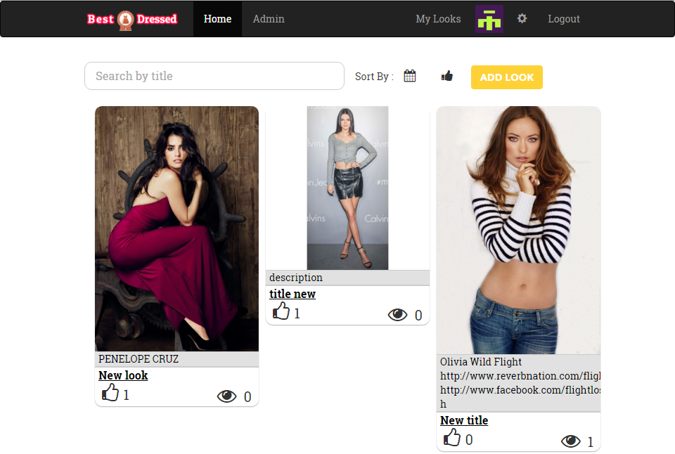
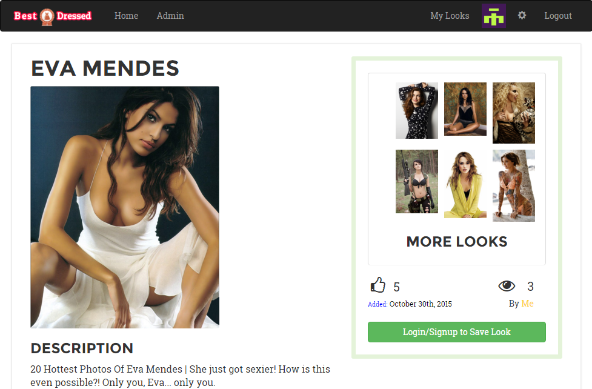
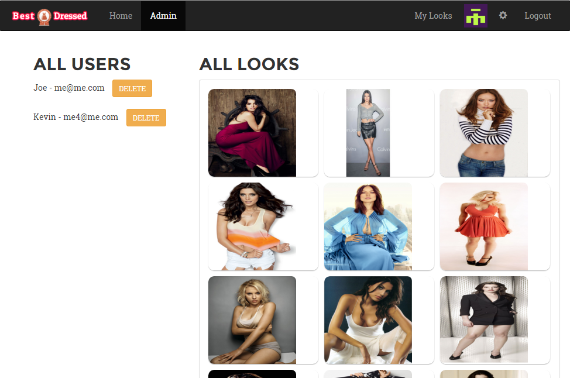

## Welcome to the Best Dressed Repo

1. bower install
2. npm install
3. create an account and login
4. profit

### Current Features
- Authentication, Scraping (pinterest) -> save + updates view
- Upload images, show All Looks & User Looks
- UI grid, page for Look details, Gravatar
- Details Page with ->
- - Comment area w/ schema (match to user/push on save)
- - Sidebar  =  title / name / date / show looks (most upVotes) / login to save   
- - Show Views/Likes
- Edit/Delete look on myLooks page, Upvoting Ability
- Transition animation (fix nav animation)
- Admin area = delete users/looks
- Infinite Scroll  (loading 6)

#### Front Page

#### Look page

### Admin page

### My Looks page

